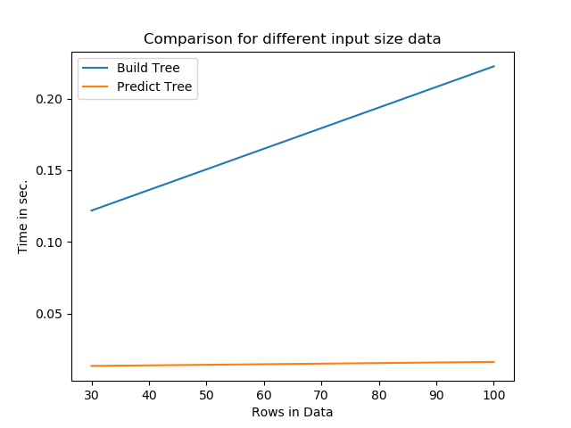

# ES654-2020 Assignment 1

*Jatin Kumar* - *19210045 (M.Tech.-CSE)*

------

> Write the answers for the subjective questions here

##Question-2
Accuracy:  0.9555555555555556
Class Name:  Iris-setosa    
Precision:  1.0
Recall:  1.0

Class Name:  Iris-virginica 
Precision:  1.0
Recall:  0.8888888888888888 

Class Name:  Iris-versicolor
Precision:  0.8947368421052632
Recall:  1.0

***Cross Validation***
*5 times loop will iterate and for it data is divided in train data : 80% and test data: 20%*

Fold:  1
Accuracy:  0.7333333333333333
Class Name:  Iris-virginica  
Precision:  1.0
Recall:  0.7333333333333333  

Fold:  2
Accuracy:  0.9333333333333333 
Class Name:  Iris-versicolor  
Precision:  0.8333333333333334
Recall:  1.0

Class Name:  Iris-virginica
Precision:  1.0
Recall:  0.9

Fold:  3
Accuracy:  0.8666666666666667
Class Name:  Iris-versicolor
Precision:  1.0
Recall:  0.8666666666666667

Fold:  4
Accuracy:  0.9666666666666667
Class Name:  Iris-setosa
Precision:  1.0
Recall:  1.0

Class Name:  Iris-versicolor
Precision:  1.0
Recall:  0.9

Fold:  5
Accuracy:  1.0
Class Name:  Iris-setosa
Precision:  1.0
Recall:  1.0

##Question-3

RMSE:  4.55748834337511
MAE:  2.0068

**Skikit learn Data**
RMSE:  4.55748834337511
MAE:  2.0068

##Queston-4

#Theoritical Time Complexity
Build Tree - o(mnlog(m)) where m is no. of samples and n is no of features
Predict Time - o(log(m)) where m is no of samples

*Sample data size* 
Rows = 30
Cols =6

**Case-1 Real Input, Real Output**
 Build Tree:  0.17983839999999995 sec
 Predict Tree:  0.012483400000000033 sec

**Case 2 Real Input and Discrete Output**
Build Tree:  0.21194659999999987 sec
Predict Tree:  0.015118399999999976 sec

**Case 3 Discrete Input and Discrete Output**
Build Tree:  0.12033019999999994 sec
Predict Tree:  0.011584800000000062 sec

**Case 4 Discrete Input and Real Output**
Build Tree:  0.12184499999999998 sec
Predict Tree: 0.013385800000000003 sec

*Rows = 100 and Cols= 6*
Build Tree:  0.2225138000000002 sec
Predict Tree: 0.016191500000000136 sec

